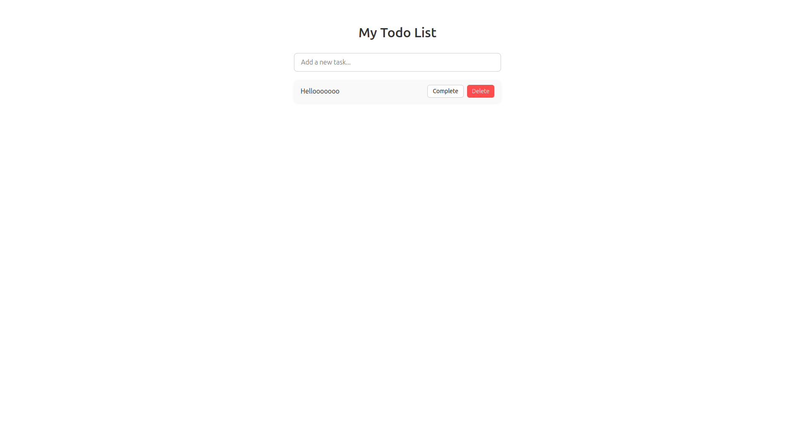

# 📝 React Todo App (with Vite)

A simple and minimalist Todo App built using **React**, **Vite**, and **CSS Modules**. This app lets users add, toggle, and delete tasks with a clean and modern UI.

## 📸 Preview

 

## 🚀 Features

- Add new todos
- Mark todos as completed
- Delete todos
- Minimalist and modern design with CSS Modules
- Uses `useReducer` for state management

## 🛠️ Tech Stack

- [React](https://reactjs.org/)
- [Vite](https://vitejs.dev/)
- CSS Modules

## 🧠 Learning Goals

This project helps you understand:

- React components and props
- `useState` and `useReducer` hooks
- Event handling in forms
- Component styling with CSS Modules

## 📦 Installation

1. **Clone the repository**

```bash
git clone https://github.com/miwalaa/todo-list-app.git
cd todo-list-app
code .
